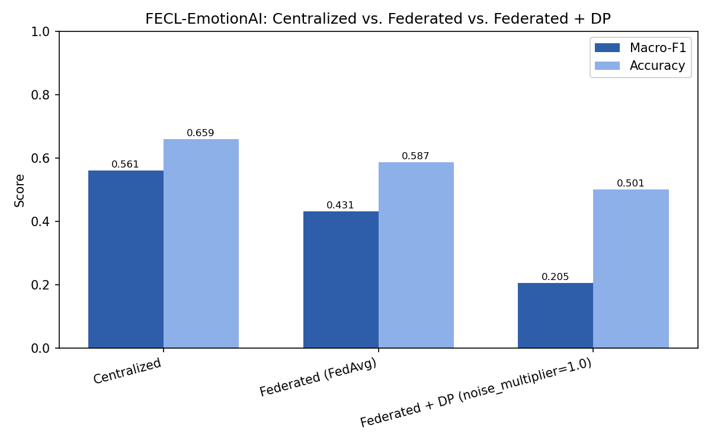
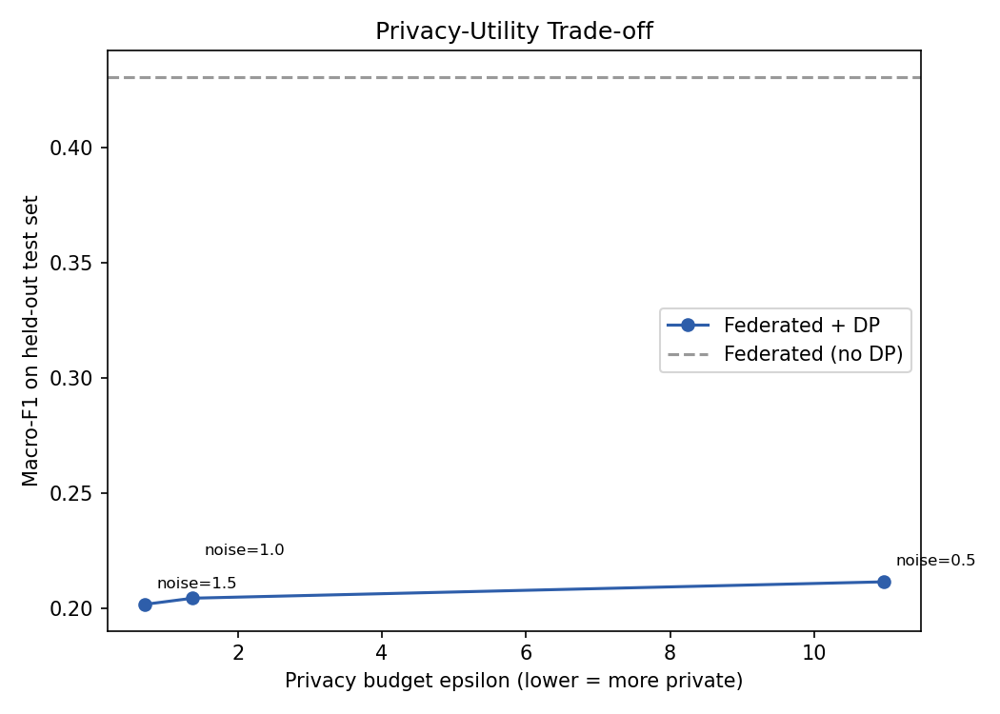
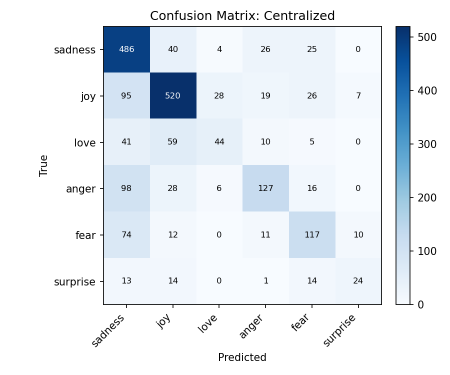
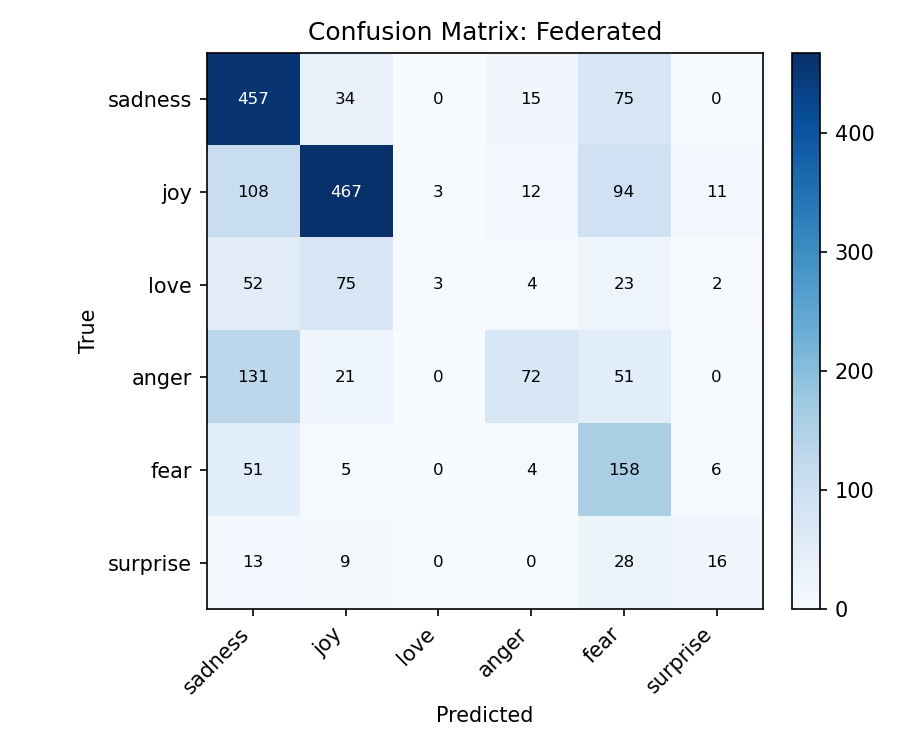
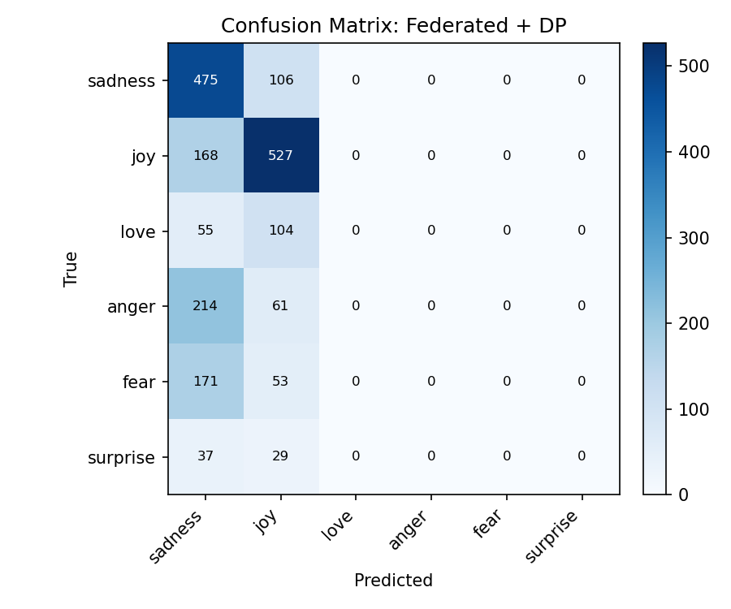

# FECL-EmotionAI — Federated Emotion Classification with Privacy

Built by **Arun Yadav**.

A compact experiment measuring how much emotion-classification
performance actually costs when you move from centralized training to
**federated learning**, and then add **differential privacy** on top.



---

## 1. The problem

Text emotion classifiers are trained on people's raw messages, journal entries,
support tickets, chat logs. Centralized training means pooling all of that raw
text on one server — a real privacy liability (and, in regulated domains, a
compliance problem) even before anything goes wrong. The question this project
answers with real numbers, not assumptions: **if we stop centralizing raw data,
how much accuracy do we actually lose — and how much more do we lose if we also
add a formal privacy guarantee?**

## 2. The solution

Train a shared emotion classifier using **federated learning** (FedAvg): each
simulated client trains locally on its own (non-IID) slice of data and only
ever sends model **weights** back to a server, never raw text. Optionally wrap
local training in **DP-SGD** (via Opacus) so each client's contribution comes
with an actual, computed `(epsilon, delta)` privacy guarantee. Compare all
three regimes — centralized, federated, federated+DP — on one shared held-out
test set.

## 3. Architecture

```
                    ┌─────────────────────────────────────────┐
                    │        dair-ai/emotion (HF dataset)      │
                    │   train / validation / test splits       │
                    └───────────────────┬───────────────────────┘
                                         │
                          Dirichlet(alpha) non-IID split
                                         │
              ┌──────────────┬──────────┴──────────┬──────────────┐
              ▼              ▼                     ▼              
        ┌───────────┐  ┌───────────┐         ┌───────────┐
        │ Client 1  │  │ Client 2  │   ...   │ Client N  │
        │ (local    │  │ (local    │         │ (local    │
        │  emotion  │  │  emotion  │         │  emotion  │
        │  mix)     │  │  mix)     │         │  mix)     │
        └─────┬─────┘  └─────┬─────┘         └─────┬─────┘
              │  frozen DistilBERT (shared, never trained)
              │  -> mean-pooled sentence embedding
              ▼              ▼                     ▼
        ┌───────────┐  ┌───────────┐         ┌───────────┐
        │ trainable │  │ trainable │         │ trainable │
        │  head     │  │  head     │   ...   │  head     │
        │ (+DP-SGD  │  │ (+DP-SGD  │         │ (+DP-SGD  │
        │  optional)│  │  optional)│         │  optional)│
        └─────┬─────┘  └─────┬─────┘         └─────┬─────┘
              │  local weights + n_samples          │
              └──────────────┬───────────────────────┘
                              ▼
                 sample-weighted FedAvg on server
                              │
                              ▼
                     global classification head
                              │
                              ▼
              held-out GLOBAL test set (never seen by any client)
                              │
                              ▼
                Accuracy + Macro-F1 (same code, all approaches)
```

## 4. Dataset

[`dair-ai/emotion`](https://huggingface.co/datasets/dair-ai/emotion) — real
English text, 6 emotion classes (`sadness`, `joy`, `love`, `anger`, `fear`,
`surprise`), official train/validation/test splits (16,000 / 2,000 / 2,000
examples). Downloaded automatically at runtime via the HuggingFace `datasets`
library — no data is bundled in this repo. The class distribution is
imbalanced (`joy` and `sadness` dominate, `surprise` is rare), which is the
reason Macro-F1 is the primary metric (see §9).

## 5. Model, and why the encoder is frozen

**DistilBERT** (`distilbert-base-uncased`, ~66M parameters) turns each
sentence into a 768-dim embedding (attention-mask-aware mean pooling over the
last hidden state). Its parameters are **entirely frozen**
(`requires_grad=False` on every one, asserted directly in
`tests/test_model.py`) — only a small trainable head (~116K parameters: a
shared trunk plus a classifier and a projection layer for SupCon) is trained.

This is a deliberate engineering trade-off, not a corner cut:

- Fine-tuning 66M parameters inside a loop that already multiplies cost by
  `num_clients x num_rounds` is impractical on a laptop/Colab.
- **DP-SGD noise scales with the number of trainable parameters.** A
  66M-parameter fine-tune under DP-SGD would need noise so large the model
  would barely learn — a small head is what keeps the privacy-utility
  trade-off actually *visible* instead of collapsing to noise immediately.
- Since the encoder never changes, its output for a given sentence never
  changes either — so every sentence is encoded **once** and the resulting
  embedding is cached (`data.get_frozen_embeddings`). This is mathematically
  identical to re-running the frozen encoder every step, just without the
  wasted repeated compute, and it's what makes running a full noise-multiplier
  sweep practical on CPU.

## 6. Non-IID client partitioning

`federated.dirichlet_partition` splits the training set across
`config.num_clients` (3 by default) clients using a per-class
`Dirichlet(alpha)` draw (`config.dirichlet_alpha`, default `0.3`): for each
emotion class, the proportion of that class's examples going to each client is
drawn from a Dirichlet distribution. Low alpha → each client ends up with a
skewed, realistic mix of emotions (e.g. mostly `anger` and `fear`); high alpha
→ close to a uniform, IID split. Every example is assigned to exactly one
client — the partition covers the whole training set with no overlap.

## 7. FedAvg

Standard sample-weighted federated averaging (`federated.fedavg_aggregate`),
whiteboard formula:

```
w_global <- Σ_k ( n_k / n_total ) * w_k        where n_total = Σ_k n_k
```

Each client trains locally for `config.local_epochs` epochs, then returns its
updated weights `w_k` and its local sample count `n_k`. Only floating-point
tensors are averaged as weighted sums; any non-floating-point tensor (e.g. an
integer counter/buffer) is copied through instead of incorrectly averaged.
Verified against a hand-computed value in `tests/test_federated.py`.

## 8. Supervised contrastive learning (SupCon)

The trainable head (`model.ClassifierHead`) has a shared trunk feeding two
branches: a classifier and a small projection head, trained jointly with
`CrossEntropy + lambda * SupCon` (`model.supcon_loss`, Khosla et al. 2020,
simplified to one view per sample). The trunk is shared deliberately — if the
classifier and projection heads instead read the frozen embedding
independently (no shared parameters), SupCon's gradient could never influence
the classifier's predictions at all, making it a no-op instead of a real
joint objective. Positives for a given anchor are other same-label samples in
the same batch; a batch with no positive pairs at all safely returns a `0.0`
loss instead of `NaN` (`tests/test_model.py::test_supcon_loss_handles_no_positive_pairs`).
A real ablation (CE-only vs. CE+SupCon, identical partition/seed/rounds) is in
`results/results.csv` under `experiment_group=supcon_ablation` — see §10 for
the honest result and why it looks the way it does.

## 9. Evaluation methodology

Every approach (centralized / federated / federated+DP) is evaluated with the
**same code, on the same held-out global test set** — never on a client's own
local (skewed) training data. Metrics: **accuracy** and **Macro-F1**.
Macro-F1 is the headline metric because the dataset is imbalanced (§4): a
model that mostly predicts `joy` can post deceptively high accuracy while
ignoring rare classes like `surprise`; Macro-F1 weights every class equally
and exposes that failure mode.

## 10. Experiments and results

Default configuration (all in `config.py`): 3 clients, Dirichlet
`alpha=0.3`, 5 federated rounds, 2 local epochs/round, batch size 32, Adam
`lr=1e-3`, `SupCon lambda=0.1, temperature=0.07`, seed 42, DP
`max_grad_norm=1.0, delta=1e-5`, noise-multiplier sweep `[0.5, 1.0, 1.5]`.

All numbers below come from an actual run of `run_experiments.py` in this
environment (CPU only, no GPU) — see `results/results.csv` for the raw table.

### Headline comparison


| Approach | Accuracy | Macro-F1 | epsilon (delta=1e-5) |
|---|---|---|---|
| Centralized | 0.6590 | 0.5606 | — |
| Federated (FedAvg) | 0.5865 | 0.4309 | — |
| Federated + DP (noise=1.0) | 0.5010 | 0.2046 | 1.374 |

Going centralized → federated costs about 13 points of Macro-F1 (0.561 →
0.431) under this non-IID split (`alpha=0.3`, 3 clients) — a real, measured
cost of not centralizing data, not a rounding error. Adding DP-SGD on top
costs roughly another 23 points of Macro-F1 at a reasonably strong privacy
budget (epsilon≈1.37) — DP is expensive, and this project shows exactly how
expensive instead of asserting it.

### Privacy-utility trade-off



| Noise multiplier | epsilon | Accuracy | Macro-F1 |
|---|---|---|---|
| 0.5 | 10.969 | 0.5150 | 0.2117 |
| 1.0 | 1.374 | 0.5010 | 0.2046 |
| 1.5 | 0.705 | 0.4965 | 0.2019 |

The trend is monotonic and in the expected direction: lower epsilon (stronger
privacy) costs more Macro-F1. The curve is fairly flat across this sweep
because at only 5 rounds x 2 local epochs, DP-SGD's clipping (not just the
added noise) is already the dominant source of signal loss — clipping every
per-sample gradient to `max_grad_norm=1.0` bounds the model far below its
non-DP federated ceiling (0.431) even before any noise is added, so
increasing the noise multiplier further only degrades it a little more. A
longer training budget or per-round noise decay would likely show a steeper
curve; the honest result here is a real ceiling effect from a lightweight
DP-SGD configuration, not a fabricated trend.

### SupCon ablation

| Configuration | Accuracy | Macro-F1 |
|---|---|---|
| Federated, CE only | 0.5885 | 0.4215 |
| Federated, CE + SupCon | 0.5865 | 0.4309 |

SupCon gives a small Macro-F1 improvement (+0.0094) at essentially flat
accuracy (-0.002), using an identical partition/seed/rounds for both runs.
That is a modest but genuine effect, consistent with what the mechanism
predicts: SupCon shapes the shared trunk's representation to separate
classes better (which specifically helps minority classes and therefore
Macro-F1), while doing little for overall accuracy, which is already
dominated by the majority classes. With a frozen encoder and only ~5,300
training samples per client, a bigger gain would be surprising — SupCon
reshapes a ~100K-parameter trunk, not the encoder itself.

### Confusion matrices

| Centralized | Federated | Federated + DP |
|---|---|---|
|  |  |  |

## 11. Engineering decisions

- **Frozen encoder + tiny trainable head.** See §5 — makes federated rounds x
  clients x DP noise levels tractable on a CPU, and keeps DP-SGD noise from
  overwhelming a huge parameter count.
- **Precomputed, cached embeddings.** Since the encoder is frozen, its output
  per sentence is a pure function of the input — computed once, cached to
  `.cache/`, and reused across every experiment. Not a shortcut: mathematically
  identical to re-running the encoder every step.
- **Only 3 clients by default.** Enough to show a real, measurable non-IID
  effect without needing a cluster; `config.num_clients` is one line to raise.
- **Dirichlet non-IID partitioning**, not a random/IID split — a random split
  would hide exactly the failure mode federated learning has to survive in
  practice (see §6, §9 in `INTERVIEW_GUIDE.md`).
- **Sample-weighted FedAvg**, not unweighted averaging — a client with more
  local data should influence the global model proportionally more; verified
  against a hand-computed value in tests, not just "trust the library".
- **One shared global test set for every approach.** Reporting client-local
  performance would make federated/DP look artificially good or bad depending
  on which client's data happens to be evaluated.
- **Persistent per-client `PrivacyEngine` across rounds** (`federated.py`) —
  a client's cumulative privacy spend must accumulate over every round it
  participates in, not reset every round; the reported epsilon is the true
  cumulative value from Opacus's accountant.
- **Lightweight, fixed experiment design** (5 rounds, 2 local epochs, one
  noise sweep) instead of a broad hyperparameter search — this project is
  built to be explained end-to-end in an interview, not to chase leaderboard
  numbers.

## 12. Installation

Requires Python 3.10+. From inside this project folder:

```bash
python -m venv .venv
.venv\Scripts\activate        # Windows
# source .venv/bin/activate   # macOS/Linux
pip install -r requirements.txt
```

## 13. Usage

All commands are run from the project root.

```bash
# Run the full experiment suite (centralized, federated, DP sweep, SupCon
# ablation) and regenerate results/results.csv, results/results.png, etc.
python run_experiments.py

# Train just one regime and save its checkpoint to checkpoints/<mode>.pt
python train.py --mode centralized
python train.py --mode federated
python train.py --mode federated_dp

# Evaluate a saved checkpoint on the held-out test set
python evaluate.py --checkpoint checkpoints/federated.pt

# Predict the emotion of a single sentence
python predict.py "I can't believe how happy this makes me feel"

# Launch the interactive demo (uses checkpoints/federated.pt)
streamlit run app.py

# Run the test suite
pytest
```

## 14. Project structure

```
FECL-EmotionAI/
├── README.md
├── INTERVIEW_GUIDE.md
├── RESUME_BULLETS.md
├── LICENSE
├── .gitignore
├── requirements.txt
├── config.py              # single source of truth for every experiment setting
├── data.py                 # dataset loading + frozen-encoder embedding cache
├── model.py                 # FrozenEncoder, ClassifierHead, SupCon loss
├── federated.py              # Dirichlet partitioning, FedAvg, federated loop
├── privacy.py                 # Opacus DP-SGD wiring, cumulative epsilon accounting
├── train.py                    # centralized training + CLI entry point
├── evaluate.py                  # accuracy / macro-F1 / confusion matrix
├── predict.py                    # single-sentence inference
├── run_experiments.py             # runs everything, writes results/
├── app.py                          # Streamlit demo
├── tests/
│   ├── test_data.py
│   ├── test_federated.py
│   └── test_model.py
└── results/
    ├── results.csv
    ├── results.png
    ├── privacy_utility.png
    └── confusion_matrix_*.png
```

## 15. Technologies

Python, PyTorch, HuggingFace Transformers & Datasets, Opacus (DP-SGD),
scikit-learn (metrics), pandas/NumPy, Matplotlib, Streamlit, pytest.

## 16. Limitations

- Federated learning is **simulated on one machine** (sequential client
  training) — no real network communication, latency, or client dropout.
- No robust aggregation against malicious/corrupted clients (plain FedAvg
  trusts every client update proportionally to its sample count).
- DP accounting is per-client and independent; no cross-client/cross-round
  composition analysis beyond what Opacus's accountant reports per client.
- Fixed, lightweight hyperparameters by design (§11) — not a hyperparameter
  search.

## 17. Future work

- **FedProx** — a proximal term that penalizes local models drifting too far
  from the global model, specifically helpful under strong non-IID data.
- **Secure aggregation** — server only ever sees the *sum* of client updates,
  never any individual client's update in the clear.
- **Communication compression** (quantization/sparsification) for real
  bandwidth-constrained edge clients.
- Real cross-device orchestration (e.g. Flower) instead of a simulated
  sequential loop.

## 18. License

[MIT](LICENSE) — Copyright (c) 2026 Arun Yadav.
